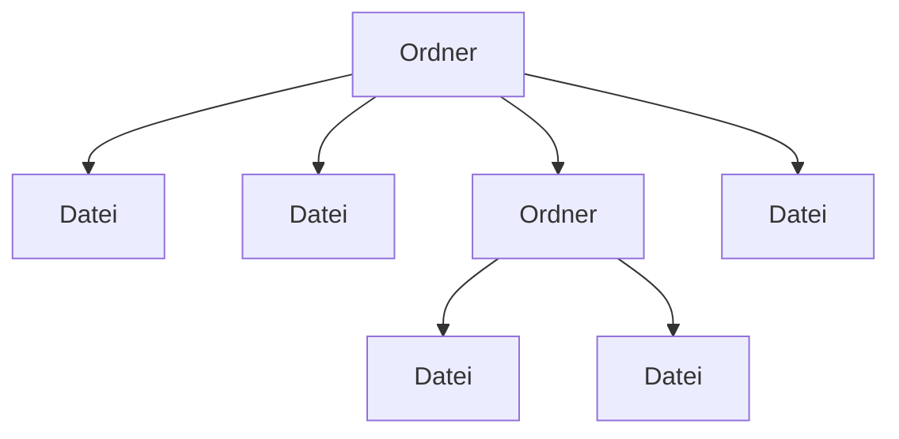
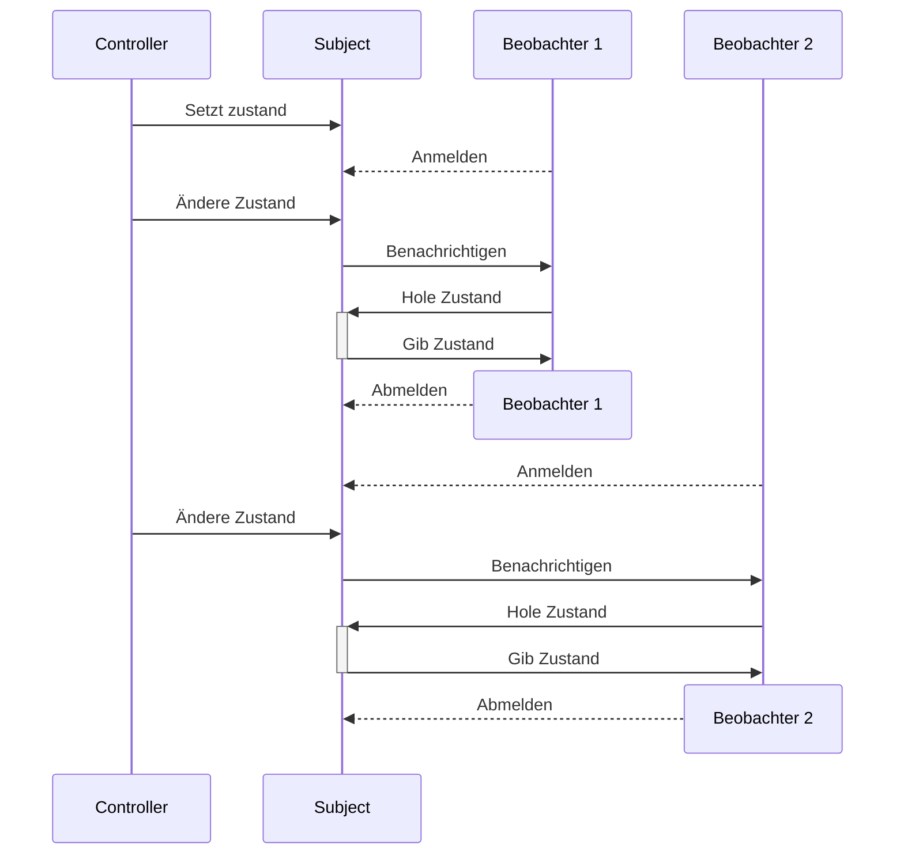

# Diagrams

### Composit_folders.svg

```mermaid
flowchart TD
    A[Ordner] --> B[Datei]
    A --> C[Datei]
    A --> D[Ordner]
    A --> E[Datei]
    D --> F[Datei]
    D --> G[Datei]
```

### Observer_sequenve.svg

```mermaid
sequenceDiagram
    participant c as Controller
    participant s as Subject

    c->>s: Setzt zustand

    participant o1 as Beobachter 1
    o1-->>s: Anmelden

    c->>s: Ändere Zustand
    s->>o1: Benachrichtigen
    o1->>+s: Hole Zustand
    s->>-o1: Gib Zustand
    destroy o1
    o1-->>s: Abmelden

    participant o2 as Beobachter 2
    o2-->>s: Anmelden

    c->>s: Ändere Zustand
    s->>o2: Benachrichtigen
    o2->>+s: Hole Zustand
    s->>-o2: Gib Zustand
    destroy o2
    o2-->>s: Abmelden
```
