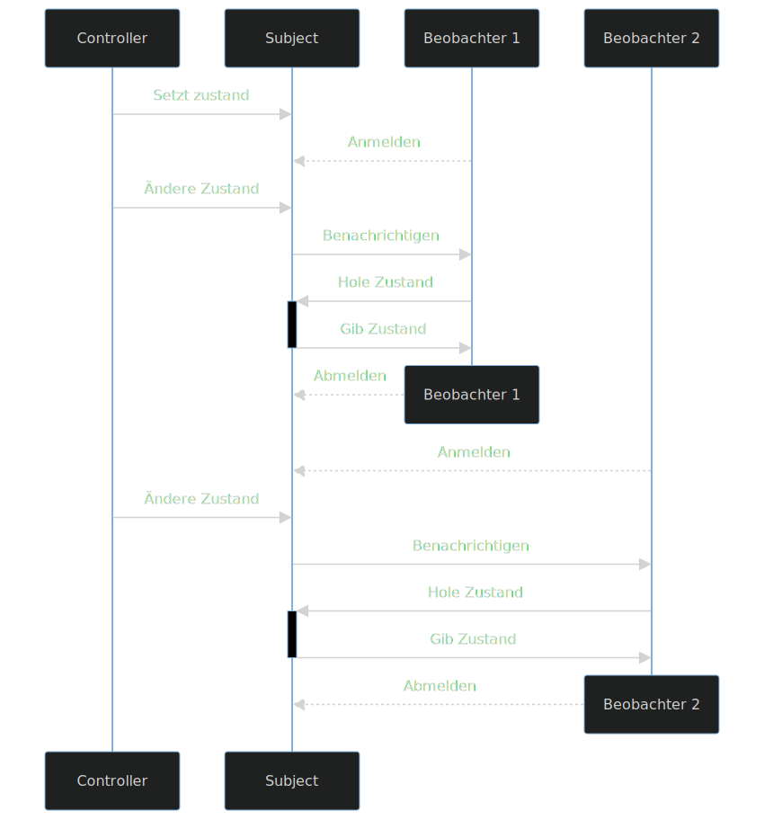

# Design Pattern

---

<!-- paginate: true -->

<!-- header: "Design-Pattern" -->

### Inhalt

- Komposite Muster
- Iterator Muster
- Beobachter Muster
- Singleton Muster
- Fabrik Muster

---

## Komposite Muster

<!-- header: "Komposite Muster" -->

> Füge Objekte zu Baumstrukturen zusammen, um Teil-Ganzes-Hierachien zu repräsentieren. Das Kompositmuster ermöglicht es Klienten, einzelne Objekte sowie Kompositionen von Objekten einheitlich zu behandeln.
> _(Erich Gamma, 1995 (Übersetzt: Dirk Riehle))_

---

### Zweck

- Objekte zu Baumstrukturen
- Teil-Ganzes-Beziehungen
- Grupieren von Komponenten

---

### Erklärung

- Eine Komponente besteht aus anderen Komponenten, die wieder aus anderen Komponenten bestehen
- Kann auch aus sich selber bestehen

---



---

### Wann nutzen?

- Zusammengesetzte Komponenten
- gleich verwendete Komponenten (Unterschiede nicht Wichtig)

---

<!-- header: "Iterator Muster" -->

## Iterator Muster

> Bietet eine Möglichkeit, um auf die Elemente eines zusammengesetzen Objekts sequenziell zugreifen zu können, ohne die zugrundeliegende Repräsentation offenzulegen.
> _(Erich Gamma, 1995 (Übersetzt: Dirk Riehle))_

---

### Zweck

- über Liste iterieren
- Struktur der Liste verbergen
- Einheitliches Interface

---

### Erklärung

- Schnittstelle zwischen Anwendung und Liste
- Listen unterschiedlich implementiert, Iterator immer gleich
- Übersetung für die einzelnen Listen

---

- Implementiert Methoden
  - `start()` - Springe an den Anfang (index 0)
  - `next()` - Nächstes Element
  - `hasNext()` - Sind wir beim Letzten Element
  - `getCur()` - Aktuelles Element holen
- `ArrayList` != `LinkedList` -> implementierung unterschiedlich

---

### Wann nutzen?

- Einheitliche Struktur für Listen
- Listenstruktur abstrahieren
- Austauschen von Listentyp

---

<!-- header: "Beobachter Muster" -->

## Beobachter Muster

> Definiere eine 1-zu-n-Abhängigkeit zwischen Objekten, so dass die Änderungen des Zustandes eines Objektes dazu führt, dass alle abhängigen Objekte benachrichtigt und automatisch aktualisiert werden.
> _(Erich Gamma, 1995 (Übersetzt: Dirk Riehle))_

---

### Zweck

- Klare Trennung zwischen Speicher, Verarbeitung und Anzeige
- Auf Änderungen reagieren

---

### Erklärung

- `Subjekt` speichert Daten
- `Beobachter` nutzt Daten von Subjekt
- Beobachter meldet sich bei Subjekt an / ab
- Subjekt benachrichtigt Beobachter bei Änderungen

---



---

### Wann nutzen?

- Mehrere Objekte verwenden die selbe veränderliche Datenquelle.
- Lose Kopplung zwischen Subjekt und Beobachter
- Benutzeroberflächen / Anzeigen

---

<!-- header: "Singleton Muster" -->

## Singleton Muster

> Sichert ab, dass eine Klasse genau ein Exemplar besitzt, und stelle einen globalen Zugrifspunkt darauf bereit.
> _(Erich Gamma, 1995 (Übersetzt: Dirk Riehle))_

---

### Zweck

- Ein einziges Objekt einer Klasse

---

### Erklärung

- Blockieren des Konstruktors
- Eine Instanz speichern
- Statische Methode zum erhalten der Instanz

---

- Viele Möbelstücke, eine Leinwand
- Mehrere Drucker, nur ein Manager

---

```java
class Manager {
    protected Manager managerInstance;

    public static Manager getManager() {
        if(managerInstance == null) managerInstance = new Manager();
        return managerInstance;
    }
    private Manager() {
        // Manager Constructor
    }
    public void hello(){
        // example Method
    }
}

// Beispielaufruf
Manager m = Manager.getManager();
m.hello();
```

---

### Wann nutzen?

- Es soll nur ein Exemplar einer Klasse geben, das von überall verwendet werden soll
- Globale Konfigurationen speichern
- Single source of truth

---

<!-- header: "Fabrik Muster" -->

## Fabrik Muster

> Definiere eine Klassenschnittstelle mit Operatoren zum Erzeugen eines Objektes, aber lasse Unterklassen entscheiden, von welcher Klasse das zu erzeugende Objekt ist. Fabrikmethoden ermöglichen es einer Klasse, die Erzeugung von Objekten an Unterklassen zu delegieren.
> _(Erich Gamma, 1995 (Übersetzt: Dirk Riehle))_

---

### Zweck

- Namentliche Trennung von überladenen Konstruktoren
- Erstellen mehrerer Unterklasen (Bedingungen)

---

### Erklärung

- Statische Methode zum erstellen von Instanzen einer Klasse
- Berechnungen vor dem Erstellen einer Instanz anstellen
- Erstellt und liefert eine Instanz einer Klasse zurück
- Kann unterschiedliche Unterklassen erstellen

---

```java
class Stuhl {
    private int x, y;

    public Stuhl (int nX, int nY) {
        x = nX;
        y = nY;
    }

    public static Stuhl erstelleDefaultStuhl() {
        return new Stuhl(100, 100);
    }
    public static Stuhl erstelleStuhlBei(int nX, int nY) {
        return new Stuhl(nX, nY);
    }
}
```

---

### Wann nutzen?

- Konstruktoren Namen geben um Verwirrung zu vermeiden
- Zur Laufzeit entscheiden, welche Unterklasse genutzt bzw. erstellt werden soll
- Umwaldeln von Objekten in Objekte anderer Klassen

---

<!-- header: "Gruppenarbeit" -->

## Gruppenarbeit

- Jede Gruppe ein Projekt und eine Aufgabe
- Lösungen im Blog festhalten
- Am Ende vorstellen

---

| Gruppe |        Thema        |          Schüler          |  Projekt   |
| :----: | :-----------------: | :-----------------------: | :--------: |
|   G1   | Singleton, Komposit |   Lukas S., Abu, Yigit    | `Basis-G1` |
|   G2   |      Iterator       | Richards, Lukas Y., Robin | `Basis-G2` |
|   G3   |      Observer       |  Sahib, Gracjan, Danilo   | `Basis-G3` |
|   G4   |       Factory       |   Cedric, Zoraiz, Lars    | `Basis-G4` |
